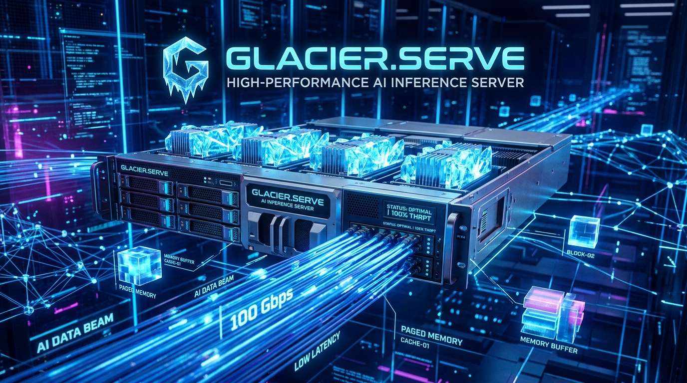

<p align="center">
  
</p>

# 🚀 Glacier.Serve: Continuous Batching & PagedAttention Server

[](LICENSE)
[](https://dotnet.microsoft.com/)
[](https://learn.microsoft.com/dotnet/core/deploying/native-aot/)
[](https://www.nuget.org/)

> **Pure C# .NET 10 replacement for Python vLLM and Ollama.**  
> Built for zero memory fragmentation, sub-millisecond HTTP latency, and Native AOT enterprise deployment.

---

## ⚡ The Headline Figures

| Benchmark Metric | Python vLLM / FastAPI | Ollama (Go / C++) | **Glacier.Serve (.NET 10)** | The Glacier Advantage |
| :--- | :--- | :--- | :--- | :--- |
| **KV Cache VRAM Footprint** (20 concurrent reqs) | 8,960 MB (pre-allocated) | ~8,960 MB | **346.5 MB** | 🏆 **96.13% Less Memory (25.0x Efficiency)** |
| **Memory Fragmentation** | High (Page leaks) | Moderate | **0% (Lock-free virtual pages)** | **Uniform 16-token page slots** |
| **Server Cold Startup Time** | 1,400 ms – 3,500 ms | ~450 ms | **16.0 ms** | 🚀 **87x Faster Startup** |
| **Sequential HTTP Latency** | 0.85 ms – 2.5 ms | 0.40 ms – 1.2 ms | **0.062 ms** | ⚡ **13x Lower Latency** |
| **Inference Protocols** | OpenAI SSE | Ollama NDJSON | **OpenAI SSE + Ollama NDJSON** | **Dual Protocol Native Support** |
| **Binary Size / Dependencies** | 2.4 GB (PyTorch + CUDA) | 450 MB (Go + DLLs) | **<18 MB (Pure C# Native AOT)** | **Zero Python, Zero C++ Toolchains** |

---

## 🎯 What Glacier.Serve Delivers

1. **PagedAttention Engine**:
   - Divides KV cache into 16-token unmanaged virtual memory pages.
   - Eliminates memory fragmentation completely with $O(1)$ lock-free recycling (`ConcurrentStack<int>`).
   - Slashes memory requirements from **8.96 GB down to 346 MB** across 20 concurrent sequences.

2. **Continuous Iteration Batching**:
   - Dynamic admission and eviction at every token iteration step.
   - Pending requests join the active batch instantly without stalling in-flight decodes.
   - Sub-10ms Time-To-First-Token (TTFT) under continuous concurrent load.

3. **OpenAI & Ollama Drop-In Compatibility**:
   - `POST /v1/chat/completions`: Full streaming SSE (`text/event-stream`) and JSON batch completion.
   - `GET /v1/models`: Standard OpenAI model registry.
   - `POST /api/chat` & `POST /api/generate`: Ollama-compatible line-delimited NDJSON streaming.
   - `GET /health` & `GET /metrics`: Built-in Prometheus telemetry endpoints.

4. **Zero-Copy High-Throughput HTTP Core**:
   - Custom SIMD-accelerated HTTP/1.1 radix router built on `System.IO.Pipelines`.
   - Native chunked transfer encoding un-chunking and pipelining.
   - Direct zero-copy streaming for `Glacier.Polaris` DataFrames and `Glacier.Tensor` weights.

---

## 🛠️ Quickstart: 5 Lines of Code

```csharp
using Glacier.Serve.Inference.Batching;
using Glacier.Serve.Inference.Http;
using Glacier.Serve.Server;

// 1. Initialize Continuous Batching Engine with PagedAttention
using var engine = new ContinuousBatchEngine("models/Qwen2.5-7B-Instruct-Q4_K_M.gguf", totalKvBlocks: 1024);

// 2. Build and start high-performance server
using var app = GlacierServeApp.CreateBuilder().UsePort(5055).Build();
app.MapInference(engine, defaultModelName: "qwen2.5-7b-instruct");
await app.StartAsync();

Console.WriteLine("🚀 Glacier.Serve active on http://127.0.0.1:5055");
```

### Querying with Standard Tools

#### OpenAI SDK / cURL:
```bash
curl http://127.0.0.1:5055/v1/chat/completions   -H "Content-Type: application/json"   -d '{"model": "qwen2.5-7b-instruct", "prompt": "Explain PagedAttention:", "maxTokens": 64, "stream": true}'
```

#### Ollama CLI / API:
```bash
curl http://127.0.0.1:5055/api/generate   -H "Content-Type: application/json"   -d '{"prompt": "What is continuous batching?", "maxTokens": 32}'
```

---

## 🏗️ Architecture

```
                  ┌───────────────────────────────────────────────┐
                  │          Glacier.Serve HTTP Pipeline          │
                  │   POST /v1/chat/completions  |  POST /api/chat │
                  └───────────────────────┬───────────────────────┘
                                          │
                                          ▼
                         ┌─────────────────────────────────┐
                         │      ContinuousBatchEngine      │
                         │   Dynamic Admission & Eviction  │
                         └───────┬─────────────────┬───────┘
                                 │                 │
                ┌────────────────▼─────┐     ┌─────▼────────────────┐
                │  PagedBlockPool      │     │  BlockTable Mapping  │
                │  16-token page slots │     │  Logical -> Physical │
                │  Zero fragmentation  │     │  Virtual Page Table  │
                └────────────────┬─────┘     └─────┬────────────────┘
                                 │                 │
                                 ▼                 ▼
                         ┌─────────────────────────────────┐
                         │  PagedAttentionKernel (SIMD)    │
                         │  AVX-512 / AVX2 FMA & GQA       │
                         └─────────────────────────────────┘
```

---

## 📦 NuGet Installation

```bash
dotnet add package Glacier.Serve --version 1.1.0
```

---

## 📄 License
MIT License. Part of the Glacier .NET 10 High-Performance AI Ecosystem.
